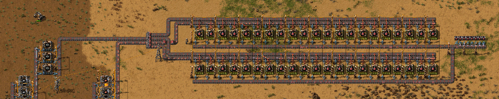
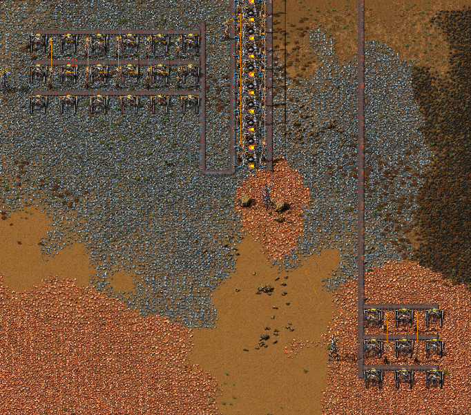

# factorio-optimization

This is a repository containing the documentation and Python code for a project for ISE 3230. The project was completed by Connor Burke, Krish Patel, and I. The course content pertains to optimization via linear programming. The project was open-ended and required finding an application for linear program modeling to a domain of our choice. We chose the video game "Factorio". A video presentation overview can be viewed [here](https://www.youtube.com/watch?v=EkG-NCBqLzQ).

### Introduction

In Factorio, your objective is to automate the collection and processing of raw materials to manufacture Science Packs, of which there are six types, which can be used to progress through the game. Our project aims to optimize the production of the simplest of these science packs, Red Science Packs, by optimizing a linear program in which the decision variables correspond to the design of our factory. The objective value is total production per minute of Red Science Packs. In order to assemble one Red Science Pack, you must use one Copper Plate and one Gear Wheel. In order to assemble a Gear Wheel, you must use two Iron Plates. Iron and Copper Plates are smelted from Iron Ore and Copper Ore, respectively. These are mined from deposits by Drills, and all assembly of intermediate and final products is done by Assemblers.

Our factory layout is simple. Iron and Copper Ore are first mined from deposits of raw materials by Drills (bottom), which place them onto conveyor belts. Then, these raw materials are smelted into Iron and Copper Plates. The Iron Plates are delivered to a group of Gear Wheel Assemblers. The Gear Wheels and Copper Plates, by the same process, are delivered to a group of Red Science Pack Assemblers (top). The output of these is our objective value. The decision variables correspond to the numbers of Drills and Assemblers as detailed in the [Decision Variables section](#decision-variables).

* 
* 

All conveyor belts have a fixed capacity and only one of two sides is used for simplicity. Items are transferred to and from conveyor belts, assembling machines, and drills by Inserters, which take a small amount of time to transfer items (though we use the fastest variant available in-game). All raw materials must be smelted, but we assume 100% throughput and build as many furnaces as necessary. Despite these attempts to mitigate error, the existence of factors that cannot be easily modeled mathematically contributes to small amounts of error in the final factory implementation, such as material buildups which our constraints should prevent, and production numbers that are slightly different from optimality. Final production details for the in-game factory are detailed in the “Results” section.

### Decision Variables

/[
\begin{align*}
\text{Maximize} \quad & x_6 \\
\text{subject to} \quad & 42x_1 \leq 900 \\
& 42x_2 \leq 900 \\
& x_5 \leq 900 \\
& x_6 \leq 900 \\
& x_5 \leq 150x_3 \\
& x_6 \leq 9x_4 \\
& x_5 = \frac{42x_1}{2} \\
& x_5 = 9x_4 \\
& 42x_2 = 9x_4 \\
& x_i \geq 0 \quad \text{for} \quad i = 1, \ldots, 6
\end{align*}
\]

### Constraints

Our objective is to maximize the Red Science Pack production per minute, so the objective function is equal to x6.

The first set of constraints deal with the conveyor belt capacity, and the throughput of the belts is 900 items per minute.

The second set of constraints deal with the Gear Wheel and Red Science Pack Assemblers and their corresponding output. A single Gear Wheel Assembler produces 150 gears per minute and a single Red Science Pack Assembler produces 9 Red Science Packs per minute.

The third set of constraints ensure that the material that is consumed is equal to the amount that was produced. Each Gear Wheel requires 2 Iron Plates to produce, and each Red Science Pack requires 9 Gear Wheels and 9 Copper Plates to produce.

The last set of constraints ensure that none of our decision variables can be negative as this would not make sense within the game.

### Results

The optimization of the Factorio Red Science Pack production process has given us results, shown in the table below. The objective function, representing the total production per minute of Red Science Packs, achieved a maximum value of 378 units. The decision variables with their given quantity output are 18 Drills for iron extraction, 9 Drills for copper extraction, 3 Gear Wheel Assemblers, 42 Red Science Pack Assemblers, 378 Gear Wheels produced per minute, and 378 Red Science Packs produced per minute. The decision variables were defined to maintain the balance between input and output quantities, considering the capacity limitation of the fast transportation belts and the speed of the assemblers.

| Component/Variables | Quantity |
| ----------------- | ---------------- |
| Iron Drills | 18 |
|Copper Drills | 9 |
| Gear Assemblers | 3 |
| Red Science Assemblers | 42 |
| Gear Production | 378 |
| Red Science Production | 378 |

